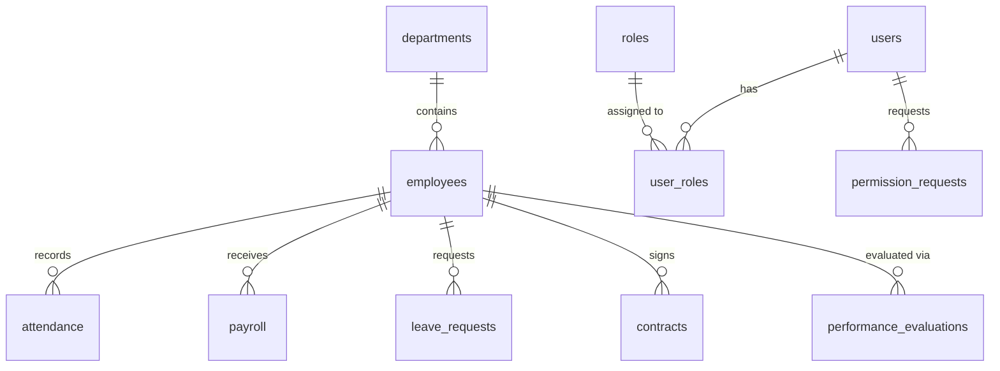

# 02_Database_Schema: Ivory HR System

## 1. Overview
This document represents the core database architecture for the Ivory HR system. It acts as the ultimate source of truth for all AI agents and developers working on the project. The system uses a highly relational structure with UUIDs as primary keys for almost all entities, and JSON columns for flexible tracking of logs, scopes, and historical data.

## 2. Core ER Diagram (Mermaid)


## 3. Database Modules (DDL)

### 3.1. Core HR Module

This module handles the organizational structure and employee records.

```sql
-- Departments Table
CREATE TABLE `departments` (
  `id` varchar(36) NOT NULL DEFAULT (uuid()),
  `name` varchar(255) NOT NULL,
  `code` varchar(50) DEFAULT NULL,
  `parent_department_id` varchar(36) DEFAULT NULL,
  `manager_id` varchar(36) DEFAULT NULL,
  `status` enum('active','inactive') DEFAULT 'active',
  PRIMARY KEY (`id`),
  FOREIGN KEY (`parent_department_id`) REFERENCES `departments` (`id`) ON DELETE SET NULL
) ENGINE=InnoDB;

-- Employees Table (Central Entity)
CREATE TABLE `employees` (
  `id` varchar(36) NOT NULL DEFAULT (uuid()),
  `employee_number` varchar(50) DEFAULT NULL UNIQUE,
  `full_name` varchar(255) NOT NULL,
  `email` varchar(255) NOT NULL,
  `department` varchar(36) DEFAULT NULL,
  `work_location_id` varchar(36) DEFAULT NULL,
  `status` varchar(50) DEFAULT 'active',
  PRIMARY KEY (`id`),
  FOREIGN KEY (`work_location_id`) REFERENCES `work_locations` (`id`) ON DELETE SET NULL
) ENGINE=InnoDB;

```

### 3.2. Time & Attendance Module

Manages daily attendance, leaves, and short permissions.

```sql
-- Attendance Table
CREATE TABLE `attendance` (
  `id` varchar(36) NOT NULL DEFAULT (uuid()),
  `employee_id` varchar(36) NOT NULL,
  `date` date NOT NULL,
  `check_in_time` time DEFAULT NULL,
  `check_out_time` time DEFAULT NULL,
  `working_hours` decimal(5,2) DEFAULT '0.00',
  `is_late` tinyint(1) DEFAULT '0',
  PRIMARY KEY (`id`),
  UNIQUE KEY `unique_attendance` (`employee_id`,`date`),
  FOREIGN KEY (`employee_id`) REFERENCES `employees` (`id`) ON DELETE CASCADE
) ENGINE=InnoDB;

-- Permission Requests Table (Recently Added)
CREATE TABLE `permission_requests` (
  `id` int NOT NULL AUTO_INCREMENT,
  `user_id` varchar(36) NOT NULL,
  `request_date` date NOT NULL,
  `start_time` time NOT NULL,
  `end_time` time NOT NULL,
  `duration_minutes` int NOT NULL COMMENT 'Calculated duration in minutes',
  `status` enum('pending','approved','rejected') DEFAULT 'pending',
  `current_stage_role_id` varchar(36) DEFAULT NULL COMMENT 'Role ID currently required to approve',
  PRIMARY KEY (`id`),
  FOREIGN KEY (`user_id`) REFERENCES `users` (`id`) ON DELETE CASCADE,
  FOREIGN KEY (`current_stage_role_id`) REFERENCES `roles` (`id`) ON DELETE SET NULL
) ENGINE=InnoDB;

```

### 3.3. Payroll & Financials Module

Handles salaries, deductions, allowances, and contract history.

```sql
-- Payroll Table
CREATE TABLE `payroll` (
  `id` varchar(36) NOT NULL DEFAULT (uuid()),
  `employee_id` varchar(36) NOT NULL,
  `month` int NOT NULL,
  `year` int NOT NULL,
  `basic_salary` decimal(12,2) DEFAULT '0.00',
  `gross_salary` decimal(12,2) DEFAULT '0.00',
  `total_deductions` decimal(12,2) DEFAULT '0.00',
  `net_salary` decimal(12,2) DEFAULT '0.00',
  `status` varchar(50) DEFAULT 'draft',
  PRIMARY KEY (`id`),
  UNIQUE KEY `unique_payroll` (`employee_id`,`month`,`year`),
  FOREIGN KEY (`employee_id`) REFERENCES `employees` (`id`) ON DELETE CASCADE
) ENGINE=InnoDB;

-- Contracts Table
CREATE TABLE `contracts` (
  `id` varchar(36) NOT NULL DEFAULT (uuid()),
  `employee_id` varchar(36) NOT NULL,
  `contract_type` varchar(100) DEFAULT NULL,
  `start_date` date NOT NULL,
  `end_date` date DEFAULT NULL,
  `gross_salary` decimal(12,2) NOT NULL,
  `approval_chain` json DEFAULT NULL,
  PRIMARY KEY (`id`),
  FOREIGN KEY (`employee_id`) REFERENCES `employees` (`id`) ON DELETE CASCADE
) ENGINE=InnoDB;

```

### 3.4. System, Security & Logs Module

Manages authentication, roles, and deep audit trailing.

```sql
-- Audit Logs (Strict System Memory)
CREATE TABLE `audit_logs` (
  `id` varchar(36) NOT NULL DEFAULT (uuid()),
  `user_id` varchar(36) DEFAULT NULL,
  `action` varchar(100) NOT NULL,
  `entity_type` varchar(100) DEFAULT NULL,
  `entity_id` varchar(36) DEFAULT NULL,
  `old_values` json DEFAULT NULL,
  `new_values` json DEFAULT NULL,
  `created_at` timestamp NULL DEFAULT CURRENT_TIMESTAMP,
  PRIMARY KEY (`id`),
  KEY `idx_audit_logs_entity` (`entity_type`,`entity_id`)
) ENGINE=InnoDB;

-- System Settings
CREATE TABLE `system_settings` (
  `id` varchar(36) NOT NULL DEFAULT (uuid()),
  `setting_key` varchar(100) NOT NULL UNIQUE,
  `setting_value` text,
  `setting_type` enum('string','number','boolean','json') DEFAULT 'string',
  PRIMARY KEY (`id`)
) ENGINE=InnoDB;

```

## 4. Architectural Rules & Assumptions

1. **Primary Keys:** Exclusively using `UUID()` generated as `varchar(36)` except for legacy or specific incremental tables (e.g., `permission_requests`).
2. **Soft vs Hard Deletes:** Deletions are typically cascaded via Foreign Keys `ON DELETE CASCADE`. The `audit_logs` table ensures data recovery.
3. **Approval Workflows:** Most transactional tables (`leave_requests`, `contracts`, `employee_trainings`, `permission_requests`) utilize a JSON-based `approval_chain` column paired with `current_stage_role_id` / `current_level_idx` to route requests dynamically.
4. **Data Types:** Financial data relies strictly on `decimal(12,2)`.